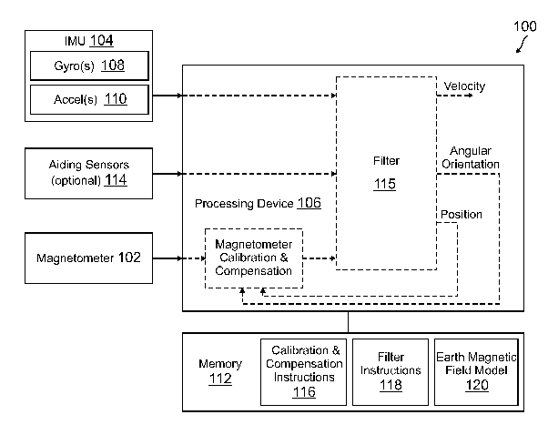

*Réponse publiée [sur Quora](https://fr.quora.com/Pourquoi-la-boussole-de-mon-t%C3%A9l%C3%A9phone-portable-n-est-pas-perturb%C3%A9e-par-la-pr%C3%A9sence-d-un-aimant-r%C3%A9manent/answer/Dr-Goulu)*

C'est une excellente question, j'ai mis plusieurs jours à essayer, demander, chercher, et finalement j'ai trouvé la réponse:

La boussole fait une "fusion de capteurs" du magnétomètre avec les accéléromètres et gyromètres.

Il y a un brevet là dessus ici : [US20150019159A1 - System and method for magnetometer calibration and compensation - Google Patents](https://patents.google.com/patent/US20150019159)

En gros :

- la mesure du magnétomètre est projetée sur le plan horizontal en utilisant les accéléromètres,
- elle est filtrée avec une longue constante de temps (minutes, heures, vous n'êtes pas censé vous promener autour d'un pôle magnétique)
- les gyromètres sont utilisés pour rendre la mesure insensible aux rotations rapides de l'appareil

Donc:

- quand vous promenez un aimant près de votre téléphone, ces perturbations sont filtrées car trop rapides
- si vous laissez votre téléphone près d'un aimant (housse avec fermoir magnétique), la mesure sera faussée et vous devrez recalibrer.
- la calibration nécessite de tourner le téléphone dans tous les sens pour retrouver le champ magnétique dominant.

J'ai honte de ne pas y avoir pensé, car c'est pile dans mon domaine (dynamique) et que j'avais écrit [Gyroscopes d'hier et de demain](/2010/04/09/gyroscopes-dhier-et-de-demain/)sur les fantastiques gyromètres intégrés que l'on trouve désormais pour quelques centimes dans nos téléphones.

Marrant aussi d'imaginer qu'après avoir filtré les mouvements des compas de marine en les montant sur des cardans pendant des siècles, maintenant on filtre le champ magnétique en laissant la boussole tourner dans tous les sens…
