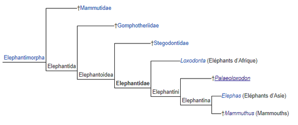
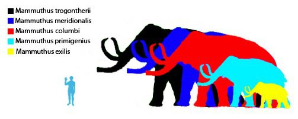
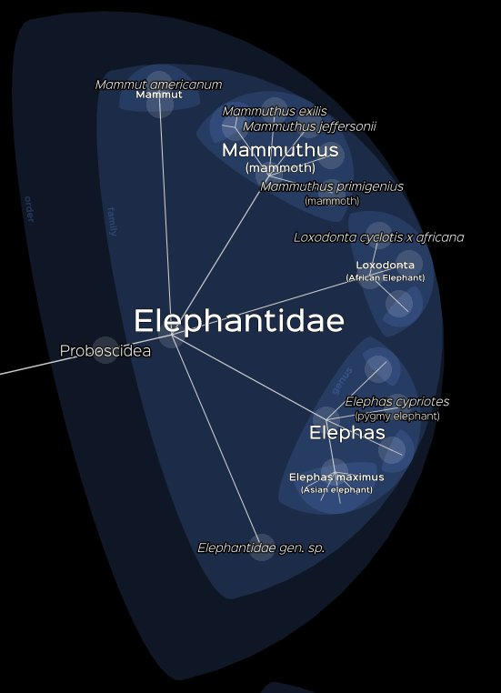

*Réponse publiée [sur Quora](https://fr.quora.com/Quels-sont-les-types-d%C3%A9l%C3%A9phants-qui-ont-disparu/answer/Dr-Goulu)*

Presque tous.

La phylogénie des éléphants est la suivante :

Sans remonter trop loin, voit que les mammouths étaient plus proches des éléphants d'Asie que les éléphants d'Afrique. Il y avait une bonne dizaine d'[espèces de mammouth](w:Mammouth) toutes disparues "récemment", il y a 12 à 15'000 ans, juste à l'époque de mon ancêtre Urgh qui les appelait "Gromiams" :

Sinon il y a une petite dizaine d'espèces de [Palaeoloxodon](w:), dont les "éléphants nains" des îles de Sicile, de Malte , Chypre, Crète, aussi disparus comme par hasard à l'époque où les humains se sont installés sur ces îles.

D'ailleurs un lointain cousin de mon ancêtre Urgh lui avait parlé de "Timiams" …

Les éléphants sur [Lifemap](http://lifemap.univ-lyon1.fr/explore.html) :

