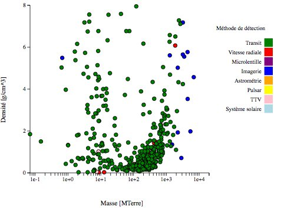

*Réponse publiée [sur Quora](https://fr.quora.com/Le-silicium-est-assez-rare-dans-l-Univers-mais-tr%C3%A8s-abondant-dans-la-cro%C3%BBte-terrestre-28-des-atomes-D-o%C3%B9-vient-une-telle-abondance-Est-ce-similaire-sur-les-autres-exoplan%C3%A8tes-telluriques/answer/Dr-Goulu)*

le Silicium est produit par la [nucléosynthèse stellaire lors de la fusion de l'oxygène](w:Nucléosynthèse_stellaire) avant d'être disséminé par supernova. C'est donc un [élément relativement abondant dans l'Univers, au 8ème rang](w:Abondance_des_éléments_chimiques), pas très loin derrière le Fer (6ème)*

Si on en reste aux matériaux "telluriques", l'Aluminium est le 3ème [élément le plus abondant dans la croûte terrestre](w:Abondance_des_éléments_dans_la_croûte_terrestre) après l'Oxygène et le Silicium, or il ne se forme que dans des étoiles très massives, ce qui a inspiré l'hypothèse de [l'étoile Coatlicue](w:Coatlicue_(étoile)).

On peut donc en déduire que les planètes telluriques constituées d'autre chose que de Fer doivent avoir été formées à partir d'un disque [Disque protoplanétaire](w:) contenant des restes de [Supernovae](w:Supernova). On estime qu'il y en a entre 1 et 3 par siècle dans la Voie Lactée, ce qui peut sembler rare, mais ça fait quand même entre 10 et 30 millions par milliard d'années, ce qui est plutôt l'échelle de temps à considérer. Et si on considère que chacune expulse un [Rémanent de supernova](w:) d'une masse solaire environ, ça fait pas mal de matière disponible pour faire des planètes…

A ma connaissance on ne peut pas (encore) déterminer la composition du sol des exoplanètes, mais on peut estimer leurs [Masses et Densités](http://exoplanetes.esep.pro/index.php/home-fr/180-diagramme-masse-densite) et tracer ce diagramme qui montre qu'on connait beaucoup de planètes gazeuses, mais aussi des telluriques avec une (trop) grande dispersion des densités, certaines étant dans l'ordre de grandeur de la Terre (5.5), d'autres proches du Fer pur (7.8) …

Note* : tiens, c'est le Néon qui est 7ème dans l'Univers, mais pas sur Terre …
