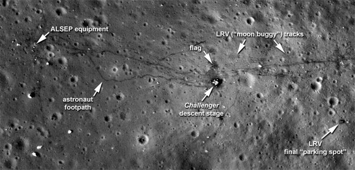

*Réponse publiée [sur Quora](https://fr.quora.com/Pourquoi-ne-voit-on-pas-nettement-et-avec-une-pr%C3%A9cision-suffisante-les-traces-des-missions-Apollo-sur-la-Lune/answer/Dr-Goulu)*

C'est quoi "une précision suffisante" ?

[New Images Offer Sharper View of Apollo Sites](https://www.nasa.gov/mission_pages/LRO/news/apollo-sites.html)

pas suffisant ? Alors payez une mission pour aller voir de plus près.
