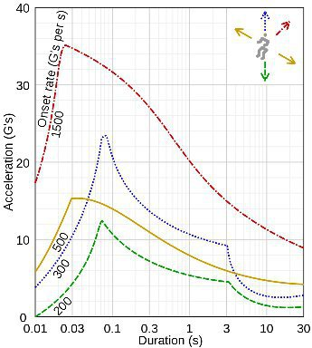

*Réponse publiée [sur Quora](https://fr.quora.com/Qu-est-ce-que-le-g-force-pourrait-avoir-comme-impact-sur-une-personne-lambda/answer/Dr-Goulu)*

Ça dépend beaucoup de la direction de l'accélération et du temps comme le montre ce graphique sur [g (accélération) — Wikipédia](w:G_(accélération)) :

Les effets aussi sont très différents : l'accélération vers le haut refoule le sang vers vos pieds et vous tombez dans les pommes par manque de sang au cerveau ("voile noir" des pilotes).

Vers le bas, c'est le "voile rouge" par afflux de sang au cerveau.
