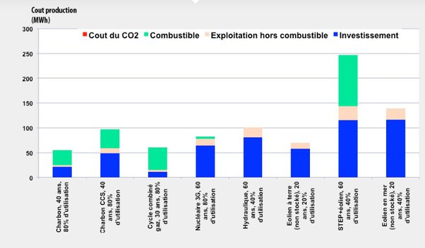

*Réponse publiée [sur Quora](https://fr.quora.com/Quelle-est-la-source-d-%C3%A9nergie-la-moins-ch%C3%A8re-pour-produire-de-l-%C3%A9lectricit%C3%A9/answer/Dr-Goulu)*

Sans taxe sur le CO2, le charbon :

[Quel est le vrai coût de l’électricité ?](https://jancovici.com/transition-energetique/electricite/quel-est-le-vrai-cout-de-lelectricite/) sur le site de JM Jancovici, vivement recommandé sur ces sujets

(le solaire n'est pas représenté pour lui laisser une chance…)
