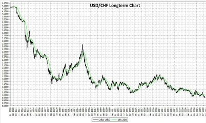

*Réponse publiée [sur Quora](https://fr.quora.com/4-mois-apr%C3%A8s-le-11-septembre-2001-le-dollar-a-entam%C3%A9-une-chute-qui-a-dur%C3%A9-9-ans-Apr%C3%A8s-9-ans-de-hausse-depuis-2011-va-t-il-bient%C3%B4t-chuter/answer/Dr-Goulu)*

Par rapport à une monnaie stable, il n'arrête pas de descendre depuis le choc du pétrole en 73, a part une hausse dans les années 80, et une petite dans les années 2000

Pas étonnant quand on voit que les USA sont en déficit commercial et budgétaire permanent.
