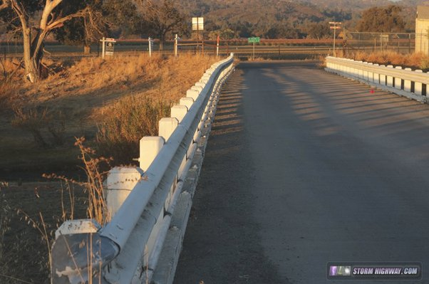

*Réponse publiée [sur Quora](https://fr.quora.com/Si-la-tectonique-des-plaques-d%C3%A9place-les-terres-d-environ-3-centim%C3%A8tres-par-an-comment-expliquer-le-maintien-des-immeubles-plusieurs-dizaines-d-ann%C3%A9es-sans-s-%C3%A9crouler/answer/Dr-Goulu)*

parce qu'ils sont sur une seule plaque, ils se déplacent avec elle.

Mais si vous construisez un pont par dessus la [Faille de San Andreas](w:)par exemple, après quelques années il aura une drôle de forme:

source : [Annette, California](https://stormhighway.com/san-andreas-fault/parkfield-cholame.php)
