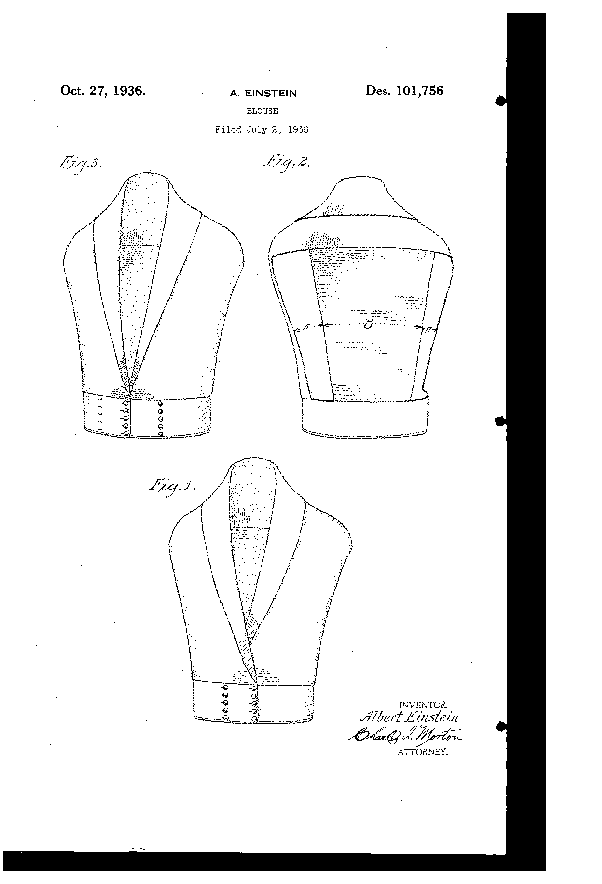

*Réponse publiée [sur Quora](https://fr.quora.com/Quels-scientifiques-c%C3%A9l%C3%A8bres-ont-eu-des-inventions-secondaires-que-la-plupart-des-gens-ignorent/answer/Dr-Goulu)*

En 1936, un certain Albert Einstein, auteur de nombreuses avancées en physique et lauréat du Prix Nobel de Physique 15 ans plus tôt, professeur à l'[Institute for Advanced Study](w:) de [Princeton](w:Princeton_(New_Jersey)), dépose le brevet

[USD101756S - Design for a blouse](https://patents.google.com/patent/USD101756S/en)

dont voici la description :

> Be it known that I, Albert Einstein, a citizen of the German Republic, residing in the Borough of Manhattan, county of New York, and State of New York, have invented a new, original, and ornamental Design for a Blouse, of which the following is a. specification, reference being had to the accompanying drawing, forming part thereof.

(Elle contient une énorme et incompréhensible erreur : Einstein n'était plus allemand depuis 1895, mais suisse depuis 1901.)

Illustrée par ce dessin :

Cette invention étant désormais dans le domaine public, on pourrait relancer la mode …
