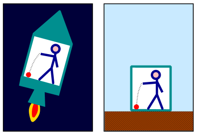
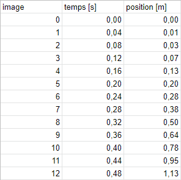
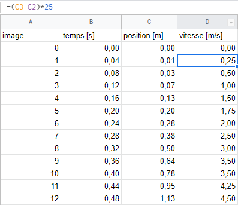
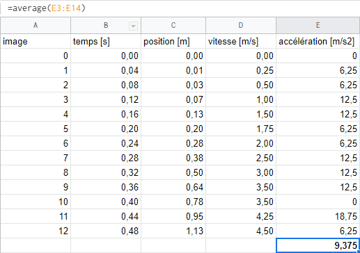

*Réponse publiée [sur Quora](https://fr.quora.com/Comment-calculer-l-acc%C3%A9l%C3%A9ration-en-chute-libre/answer/Dr-Goulu)*

En chute libre (sans frottement de l'air) vous ne ressentez aucune accélération. Les astronautes dans l'ISS, la Lune autour de la Terre, la Terre autour du Soleil etc, tous les corps sont en chute libre : pas de force sur eux = pas d'accélération.

Quand vous regardez un caillou tomber à vos pieds, c'est vous qui accélérez vers le haut. Le [Principe d'équivalence](w:) dit que ces deux situations sont indistinguables :

Cela dit, pour mesurer l'accélération de la fusée ou du sol, que vous pouvez interpréter comme l'accélération de la balle vers le sol si vous voulez mais c'est faux, il vous suffit de mesurer la position de la balle pendant qu'elle est en chute libre.

Sur Terre, avec une caméra qui prend 25 images par seconde et en regardant ensuite votre film image par image pour relever la position de la balle arrondie au centimètre près vous pouvez faire un tableau de mesure comme ça :

après, vous ajoutez un colonne pour calculer la vitesse en faisant la différence entre chaque paire de lignes :

et vous refaites la même chose pour l'accélération :

avec une petite moyenne à la fin pour tenir compte des arrondis que vous avez faits, vous tombez sur quelque chose pas de pas trop faux (5% d'erreur avec 12 mesures grossières seulement et de la dérivation numérique brutale d'ordre 1, c'est pas si mal …)

Si vous n'avez pas de caméra, vous pouvez [faire comme Galilée](w:Pesanteur) : un plan incliné avec un bille qui heurte des clochettes régulièrement espacées…
