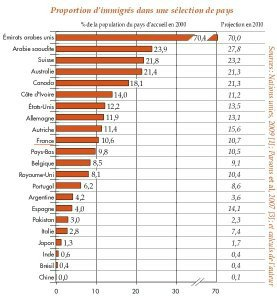

*Réponse publiée [sur Quora](https://fr.quora.com/Pourquoi-la-Suisse-qui-est-traditionnellement-un-%C3%89tat-neutre-et-ind%C3%A9pendant-c%C3%A8de-t-elle-aux-tendances-mondialistes-notamment-%C3%A0-la-promotion-du-multiculturalisme-QT/answer/Dr-Goulu)*

La neutralité n'est que militaire, et l'indépendance est partagée, que je sache, par tous les pays du monde.

La Suisse à depuis très longtemps une forte proportion de population étrangère (chiffres un peu anciens, mais rapports toujours d'actualité

La Suisse exporte beaucoup, elle vit de la mondialisation et bénéficie du multiculturalisme, donc c'est notre choix, pas une soumission.
