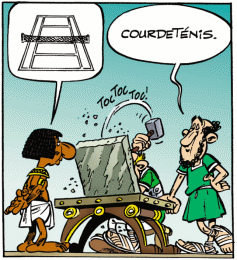

*Réponse publiée [sur Quora](https://fr.quora.com/Est-il-bon-d-%C3%A9crire-du-code-sans-IDE/answer/Dr-Goulu)*

c'est un peu comme écrire votre courrier en le gravant au burin dans du marbre:

c'est très beau, très cher, très inutile.

vous pouvez aussi stocker chaque version de vos fichiers sur une disquette avec une étiquette mentionnant la date, au lieu d'utiliser git …
