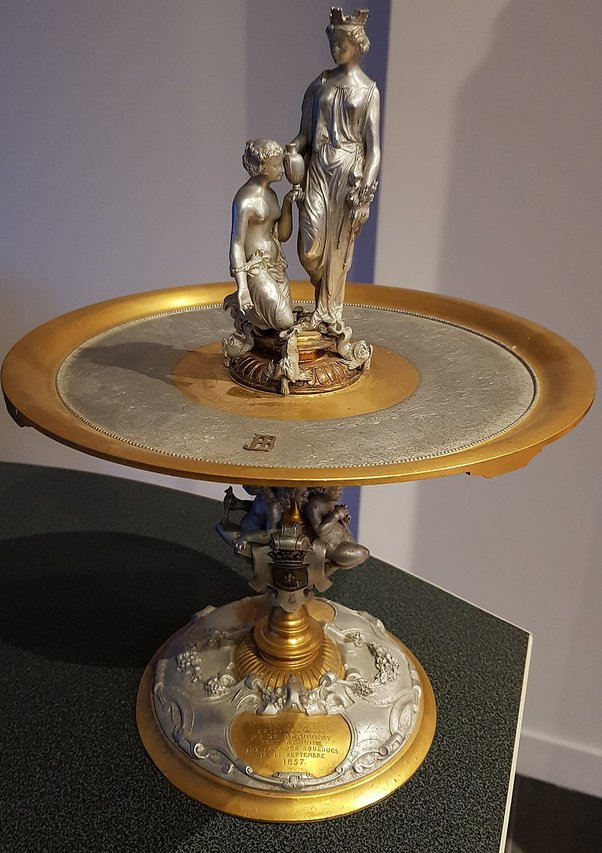

*Réponse publiée [sur Quora](https://fr.quora.com/Si-quelquun-trouvait-sur-Terre-%C3%A9norm%C3%A9ment-dor-et-quil-y-en-ait-10-fois-plus-que-daluminium-est-ce-que-le-prix-de-lor-serait-plus-bas-que-celui-de-laluminium/answer/Dr-Goulu)*

Juste pour compléter les autres réponses : il y a moins de 2 siècles, l'[Aluminium](w:)coûtait plus cher que l'or.

Il est [très abondant dans la croûte terrestre](w:Abondance_des_éléments_dans_la_croûte_terrestre), environ 70 millions de fois plus que l'or, mais avant l'apparition de l'électricité industrielle, il n'y avait pas de moyen bon marché de réduire son oxyde, alors:

> Le chimiste français Henri Sainte-Claire Deville présente en 1854 à l'Académie des sciences le premier lingot d'aluminium obtenu, à l'état fondu, par voie chimique. Sa méthode est utilisée de façon industrielle à travers toute l’Europe pour la fabrication de l’aluminium (notamment en 1859 par Henry Merle dans son usine de Salindres, berceau de la société Pechiney), mais elle reste extrêmement coûteuse, donnant un métal dont le prix était comparable à celui de l'or (1 200 et 1 500 F or/kg et l'argent 210 F/kg seulement). Le métal est alors réservé pour fabriquer des bijoux de luxe ou de l’orfèvrerie réservée à une élite.
>
>
>
> Il en est ainsi pour les coupes d'honneur et les objets d'art fabriqués pour la cour impériale de [Napoléon III](w:). Ce dernier reçoit ses hôtes de marque avec des couverts en aluminium, les autres convives devant se contenter de couverts en [vermeil](w:) (Wikipedia)

(une "coupe d'honneur" en aluminium de 1857, avec de l'or pour faire baisser le prix…)

Donc voilà : si vous croyez à l'effondrement de notre société industrielle, que bientôt on aura plus d'électricité etc, achetez des lingots d'aluminium, pas d'or.
