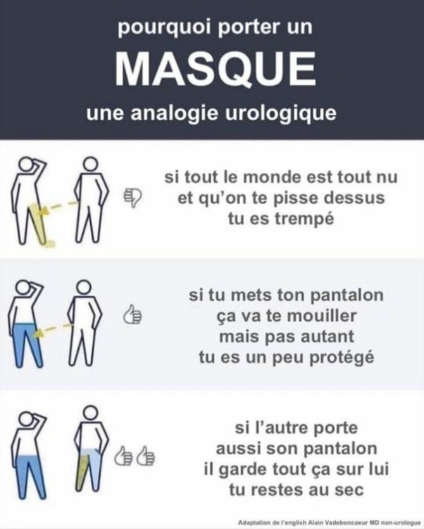

*Réponse publiée [sur Quora](https://fr.quora.com/Les-masques-aident-ils-vraiment-%C3%A0-pr%C3%A9venir-la-propagation-du-coronavirus-Le-virus-ne-peut-il-pas-traverser-nos-yeux/answer/Dr-Goulu)*

Cette illustration publiée en anglais sur Reddit à été reprise par le département de la santé de Philadelphie et traduit en de nombreuses langues

(Source [Cette illustration sur le port du masque est parfaite](https://www.aufeminin.com/none/none-s4012182.html)-au féminin)
