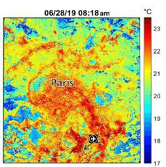

*Réponse publiée [sur Quora](https://fr.quora.com/Est-il-possible-de-cartographier-les-%C3%AElots-de-chaleur/answer/Dr-Goulu)*

On est capables de mesurer les températures du monde entier par satellite.

[Mesure de température par satellite — Wikipédia](w:Mesure_de_température_par_satellite)

Les [Îlot de chaleur urbain](w:)y sont visibles avec pas mal de details

[So Hot That We Can See Those Urban Heat Islands From Space - The Global Warming Policy Forum (GWPF)](https://www.thegwpf.com/so-hot-that-we-can-see-those-urban-heat-islands-from-space/)
