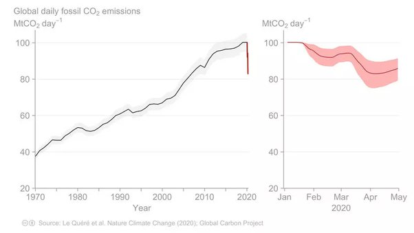

*Réponse publiée [sur Quora](https://fr.quora.com/Les-%C3%A9missions-mondiales-de-carbone-baissent-elles/answer/Dr-Goulu)*

Oui selon [Daily global CO2 emissions 'cut to 2006 levels' during height of coronavirus crisis](https://www.carbonbrief.org/daily-global-co2-emissions-cut-to-2006-levels-during-height-of-coronavirus-crisis) Les emissions 2020 vont correspondre à 2006 environ.

Reste à voir en combien de temps on reviendra à 2019…

Je parie pour 2 ans max.
