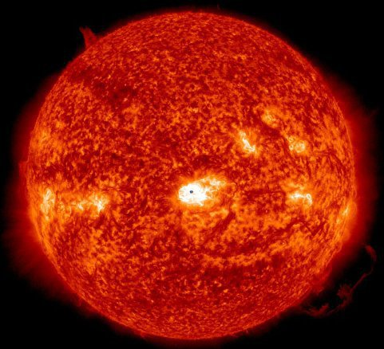

*Réponse publiée [sur Quora](https://fr.quora.com/Quelles-choses-nous-semblent-petites-mais-sont-immense-Ou-quelles-choses-sont-grandes-sans-qu-on-en-ai-la-moindre-id%C3%A9e/answer/Dr-Goulu)*

Le Soleil. Dans le ciel il a la même taille apparente que la Lune, mais en réalité il est gigantesque.

Sur le montage ci-dessous, la Terre est à l'échelle du soleil. Le petit point noir au centre…

