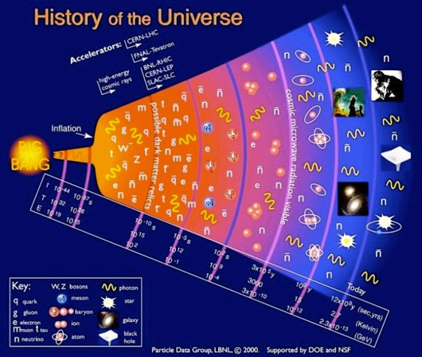

*Réponse publiée [sur Quora](https://fr.quora.com/Comment-se-fait-il-quau-moment-du-Big-Bang-lUnivers-ne-sest-il-pas-effondr%C3%A9-en-trou-noir-Y-a-t-il-une-limite-%C3%A0-l%C3%A9nergie-quun-trou-noir-peut-avaler/answer/Dr-Goulu)*

au moment du [Big Bang](w:), l'Univers n'était pas un point au milieu d'un espace vide, comme on se le représente souvent. Ce n'était pas une explosion, il n'y a pas de centre.

Les particules élémentaires* remplissaient tout l'espace, tout l'Univers. Chacune était attirée ou repoussée par ses voisines de manière équivalente. Elles n'avaient aucune raison de s'agglutiner… Le [Fond diffus cosmologique](w:)montre d'ailleurs que même 380'000 ans après, l'Univers était extraordinairement homogène.

Ce n'est que lorsque suffisamment d'espace s'est formé entre les particules qu'elles ont commencé à se lier entre elles, d'abord sous l'effet des interactions fortes pour former des protons, puis l'interaction faible a formé quelques noyaux, puis l'interaction électromagnétique a formé des atomes, et seulement après plusieurs dizaines de millions d'années en masses de gaz suffisamment massives pour courber localement l'espace-temps.

D'ailleurs, on n'observe aucun [Trou noir primordial](w:) …

Le Big Bang n'est pas forcément la naissance de l'Univers, c'est plutôt la naissance de l'espace-temps.

Note* on ne sait pas ce qu'il y avait avant les particules élémentaires, au moment de l'inflation, ni avant, pour autant que "avant" ait un sens
