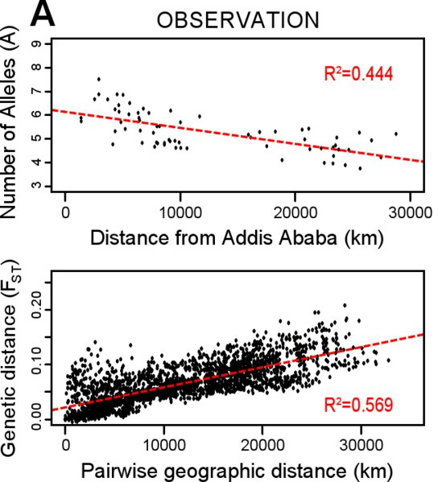

*Réponse publiée [sur Quora](https://fr.quora.com/La-grande-majorit%C3%A9-des-esp%C3%A8ces-animales-ont-des-races-attribu%C3%A9es-alors-pourquoi-n-en-avons-nous-pas/answer/Dr-Goulu)*

Pour documenter un peu l'excellente réponse de [Antonin Girardeau](https://fr.quora.com/profile/Antonin-Girardeau) , lire [Race — Wikipédia](w:Race) :

> Chez les [animaux domestiques](w:Animal_domestique), la race est un [rang taxinomique](w:) informel, inférieur à l'[espèce](w:). Les races et les sous-races sont distinguées à des fins d'[élevage](w:) et de [sélection](w:Sélection_(biologie)).
>
>
>
> …
>
>
>
> Les [taxons](w:) au rang de race n'ont pas de [noms scientifiques](w:Nom_binominal) internationaux, leur circonscription [taxinomique](w:Taxinomie) repose généralement sur des critères subjectifs et pratiques (notamment utilisés pour la désignation commerciale)
>
>
>
> …
>
>
>
> En [nomenclature botanique et mycologique](w:Nomenclature_botanique) où le terme de « race » n'est pas un rang taxinomique [codifié](w:Code_international_de_nomenclature_botanique), on parle de [variété](w:Variété_(biologie)) ou de [sous-espèce](w:).

La distinction entre espèces est assez facile à faire à un moment donné via le critère de descendance fertile, mais plus difficile à faire au cours du temps. Par exemple l'[Homme de Néandertal](w:) est aujourd'hui considéré comme une espèce distincte d'Homo Sapiens, mais il a été longtemps considéré comme une sous-espèce, alors qu'on sait qu'il y a eu de nombreuses hybridations entre les deux espèces.

La raison pour laquelle il n'existe pas ou plus de sous-espèces humaines est donnée dans [Race humaine — Wikipédia](w:Race_humaine) :

> Des études scientifiques, fondées depuis le milieu du xxe siècle sur la [génétique](w:), ont montré que le concept de « race » n'est pas pertinent pour caractériser les différents sous-groupes géographiques de l'espèce humaine **car la**[**diversité génétique**](w:Diversité_génétique)**est beaucoup plus importante entre les individus d'une même population qu'entre groupes différents**.

Le paragraphe en gras est bien illustré sur [Human genetic variation - Wikipedia](w:en:Human_genetic_variation) (hélas pas encore traduit en français…) par cette illustration:

(source [Complex genetic patterns in human arise from a simple range-expansion model over continental landmasses](https://journals.plos.org/plosone/article?id=10.1371/journal.pone.0192460))

En bas, elle montre la distance génétique de 1484 individus par rapport à l'un choisi arbitrairement à Addis-Abeba (Ethiopie) en fonction de la distance à cet endroit le long des routes de migrations supposées. On voit:

1. qu'il n'y a pas de groupes de points ni "marches" qui suggèrent une discontinuité génétique
2. que la dispersion verticale des points est au moins aussi importante que l'horizontale : un autre habitant d'Addis-Abeba est génétiquement aussi différent de celui choisi comme référence (environ 0.10 Fst) qu'un individu moyen qui vit à 25000 km de là
3. qu'il y a une (faible) tendance croissante le long de la route des migrations, accompagnée d'une baisse de diversité génétique dans les 78 groupes examinés (en haut) ce qui appuie la thèse de migration à partir de l'Afrique

Les moyens de transport actuels vont contribuer à réduire cette faible dépendance de la distance très vite …
