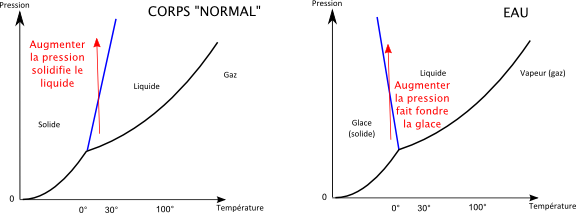
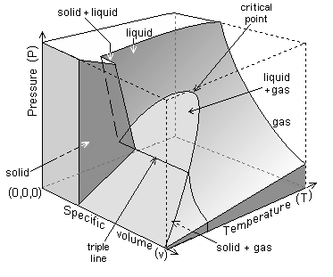

*Réponse publiée [sur Quora](https://fr.quora.com/Comment-appelle-t-on-un-mat%C3%A9riau-dont-la-forme-solide-flotte-dans-sa-propre-forme-liquide-l-eau-par-exemple/answer/Dr-Goulu)*

Je pense que ce sont les matériaux qui ont une courbe de fusion à pente négative dans leur diagramme de phase :

( source: [Skier sur du gallium](https://sciencetonnante.wordpress.com/2011/02/14/skier-sur-du-gallium/) sur le site de [David Louapre](https://fr.quora.com/profile/David-Louapre) )

Tous les matériaux étant au moins un peu compressibles, je "sens" un lien entre pression et densité, mais ce lien lors des transitions de phase n'est pas très clair pour moi, si quelqu'un a une idée…

Comme ça n'a pas l'air d'avoir de nom, je propose "matériau CFPN" pour "courbe de fusion à pente négative" …

Edit : suite à un commentaire, j'ai trouvé ce diagramme de phase de l'eau en 3D qui fait apparaître aussi la densité (ou plutôt son inverse, le volume spécifique)

là on voit bien le décrochement "solid+liquid" qui correspond à une augmentation de densité lorsqu'on passe du solide au liquide

mais ça n'a pas l'air lié à la pente négative …
