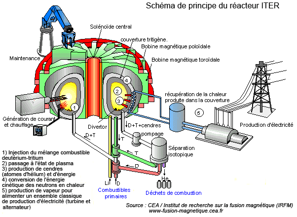

*Réponse publiée [sur Quora](https://fr.quora.com/Pouvez-vous-m-expliquer-sh%C3%A9matiquement-et-de-fa%C3%A7ons-simple-le-fonctiinnement-scientifique-du-projet-iter/answer/Dr-Goulu)*

Source : CEA [La fusion nucléaire](http://www.cea.fr/comprendre/Pages/energies/nucleaire/fusion-nucleaire.aspx?Type=Chapitre&numero=3)
