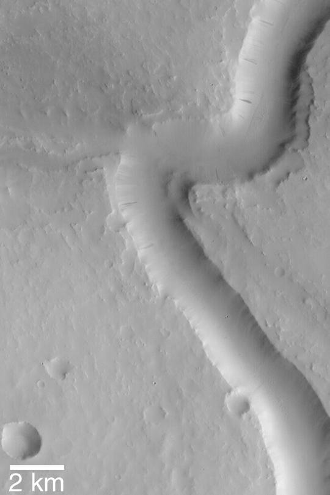
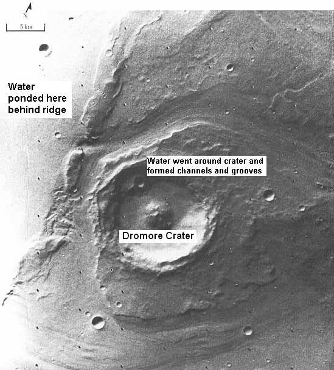
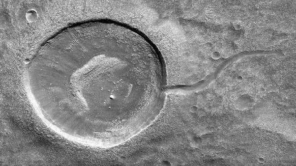

*Réponse publiée [sur Quora](https://fr.quora.com/Comment-les-scientifiques-sont-ils-si-s%C3%BBrs-quil-y-avait-autrefois-de-leau-sur-Mars/answer/Dr-Goulu)*

D'abord, il y a encore un peu d'[Eau sur Mars](w:), sous forme de glace principalement, mais quelques gouttes liquides ont été détectées.

Mais surtout, la géologie de Mars qu'on commence à bien connaître grâce aux différentes sondes et rovers montre des formations clairement associées à la présence massive d'eau.

Il y a des méandres d'anciennes rivières:

des cratères érodés:

des cratères devenus des lacs :

etc (voir l'article wikipédia)

mais aussi les analyses de roches ont découvert

> des [minéraux](w:Minéral) dont l'existence est liée directement à la présence d'eau liquide (tels que la [goethite](w:)), de l'hématite cristalline grise, des phyllosilicates, de l'opale et des sulfates

Comment on analyse les roches à distance ? Bonne question. La réponse m'a littéralement troué :

avec [La ChemCam de Curiosity - Pourquoi Comment Combien](/2014/05/26/la-chemcam-de-curiosity/)
