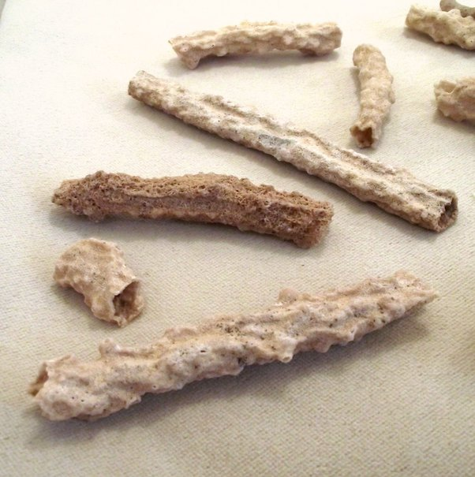

*Réponse publiée [sur Quora](https://fr.quora.com/Est-ce-que-la-foudre-transforme-le-sable-en-verre-lorsqu-elle-s-abat-sur-du-sable/answer/Dr-Goulu)*

Ca fait de la [Fulgurite](w:):

Ca ne ressemble pas trop à du verre, mais à l'intérieur des tubes c'est parfois plus joli

[Les 45 meilleures images de fulgurite](https://www.pinterest.fr/deschamps1012/fulgurite/)

On trouve plus facilement du [Verre naturel d'origine volcanique](w:Verre_volcanique)
