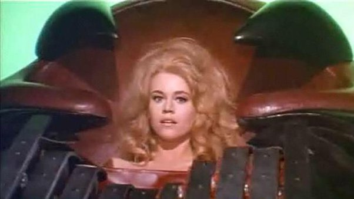

*Réponse publiée [sur Quora](https://fr.quora.com/Vous-pouvez-choisir-un-personnage-de-science-fiction-pour-vous-accompagner-lors-d-une-mission-spatiale-de-longue-dur%C3%A9e-Qui-allez-vous-choisir-et-pourquoi/answer/Dr-Goulu)*

J'étais en train de répondre "[C-3PO](w:)" quand je me suis souvenu de [Barbarella](w:) dans l'orgasmotron …

Entre mes organes préférés, mon cœur balance …
