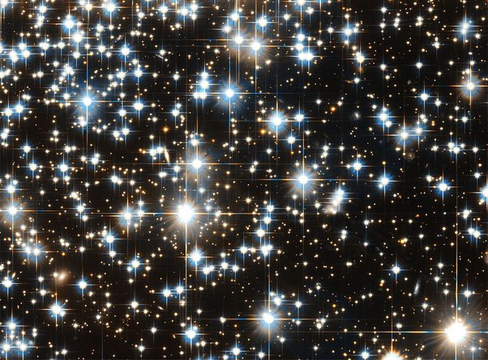

*Réponse publiée [sur Quora](https://fr.quora.com/Pourquoi-les-%C3%A9toiles-ont-elles-toujours-lair-davoir-5-pointes/answer/Dr-Goulu)*

parce que votre imagination leur donne 5 pointes.

Sur les images prises par les télescopes, elles ont 4 "aigrettes" toutes bien alignées à cause de la [diffraction](w:Aigrettes_de_diffraction) produites par la structure tenant le miroir secondaire.

(détail d'une photo de [NGC 6397](w:) par le télescope spatial Hubble. Même lui fait des aigrettes)

[Inventaire des Croix du Ciel. - Pourquoi Comment Combien](/2009/01/17/inventaire-des-croix-du-ciel/)
