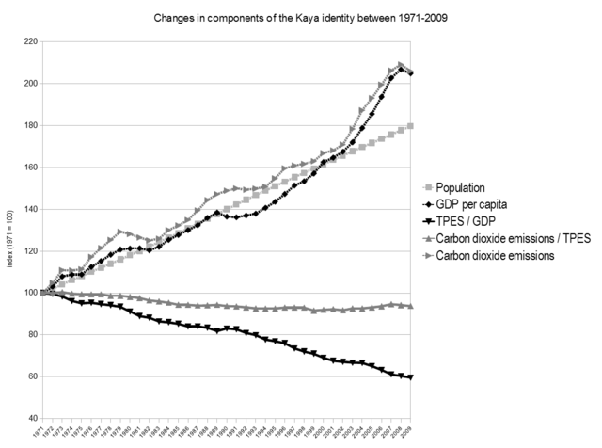

*Réponse publiée [sur Quora](https://fr.quora.com/On-nous-parle-r%C3%A9guli%C3%A8rement-souvent-du-capitalisme-comme-%C3%A9tant-la-quasi-unique-raison-du-r%C3%A9chauffement-climatique-J-ai-pour-ma-part-l-impression-que-la-population-mondiale-est-la-grande/answer/Dr-Goulu)*

Le truc à connaître absolument si vous vous intéressez à ça, c'est l'[Équation de Kaya](w:).

Jean-Marc Jancovici l'établit de façon magistrale[[1]](#bPjvE) en partant de la relation triviale $CO2=CO2$ puis en divisant et multipliant à droite successivement par :

- TEP : consommation d'[énergie primaire](w:) , ce qui donne $CO2 = \frac{CO2}{TEP} \times TEP$
- PIB : produit intérieur brut, ce qui donne $CO2 = \frac{CO2}{TEP} \times \frac{TEP}{PIB} \times PIB$
- POP : la population , ce qui donne l'équation finale, à apprendre par coeur:

$CO2 = \frac{CO2}{TEP} \times \frac{TEP}{PIB} \times \frac{PIB}{POP} \times POP$

là où cette évidence devient intéressante, c'est quand vous réalisez que les 4 facteurs sont **d'importance égale** et valent des choses parlantes:

- PIB / POP est le [PIB par habitant](w:Produit_intérieur_brut_par_habitant), qui est une mesure du niveau de vie moyen. Vous pouvez l'appeler "capitalisme" si vous voulez …
- POP, la population, qui a quand même tendance à augmenter globalement
- CO2 / TEP est le [contenu en CO2 de l'énergie](w:Contenu_CO2), le facteur sur lequel on concentre nos efforts via énergies renouvelables etc
- TEP / PIB est l'[intensité énergétique](w:Intensité_énergétique_(économie)) du PIB, la quantité d'énergie qu'on utilise pour produire un euro de biens ou services et dont personne n'a aucune idée

il faut aussi remarquer que l'équation de Kaya est valable pour le monde entier, mais aussi pour chaque pays, donc les situations peuvent être extrêmement différentes.

Par exemple dans la [Liste des pays par intensité énergétique](w:), on remarque que le "no 1" est la [République démocratique du Congo](w:) avec 4746,3 TEP/M$ alors que le "dernier" est la [République du Congo](w:) avec 30.5 TEP/M$, juste à côté avec une économie 150 fois plus efficace en énergie ! (ou des chiffres faux…) Il est clair que les priorités écologiques dans ces deux pays ne seront absolument pas les mêmes

Donc pour répondre à votre question, le "capitalisme" et la population sont deux facteurs d'égale importance, mais il y en a deux autres tout aussi importants !

Je me suis beaucoup intéressé à l'équation de Kaya ( voir [équation de Kaya Archives - Pourquoi Comment Combien](https://www.drgoulu.com/tag/equation-de-kaya/) ) et dans [400 parties par million, et moi, et moi, émoi ?](/2013/05/11/400-parties-par-million-et-moi-et-moi-emoi/)je me suis plus concentré sur votre question via l'évolution temporelle des 4 facteurs au niveau mondial, représentée dans le graphique ci-dessous (hélas jusqu'en 2009, si quelqu'un a une version plus récente, je prends…) :

On voit que:

1. L’intensité énergétique TEP/PIB s’est améliorée assez régulièrement de 40% en 40 ans (courbe “TPES/GDP” du bas sur le graphique), et les prévisions tablent sur une poursuite de cette tendance. La [liste des pays par intensité énergétique](http://www.wikipedia.org/search-redirect.php?language=fr&go=Go&search=liste+des+pays+par+intensité+énergétique) permet de voir qu’il existe de gros écarts entre pays, et que l’Europe est globalement bien placée
2. Le contenu CO2/TEP a lui aussi baissé, quoique beaucoup plus modérément (courbe “carbon dioxide emissions / TPES) .

mais ces améliorations ont été plus que compensées négativement par les deux autres.

Notes de bas de page

[[1]](#cite-bPjvE)[Qu’est-ce que l’équation de Kaya ?](https://jancovici.com/changement-climatique/economie/quest-ce-que-lequation-de-kaya/)
