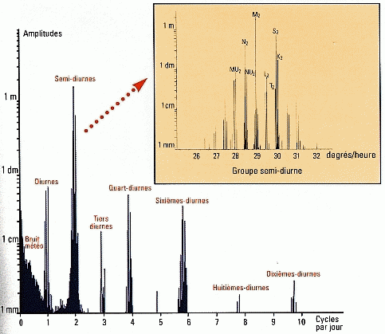

*Réponse publiée [sur Quora](https://fr.quora.com/Pourquoi-les-mar%C3%A9graphes-sont-si-compliqu%C3%A9s/answer/Dr-Goulu)*

Un [Marégraphe](w:)est un appareil qui mesure les marées. Ils ne sont pas très compliqués, il faut surtout les mettre à l'abris du clapot ou filtrer numériquement celui-ci. Il en existe de 3 types:

- [échelles et marégraphes à flotteur](w:Marégraphe)
- [marégraphes numériques côtiers](w:Marégraphe)
- [marégraphes de pression de fond](w:Marégraphe)

Si vous vouliez parler du graphique qu'ils produisent, ils sont en effet assez complexe car ils sont la somme de plusieurs oscillations de périodes (et de phases) différentes, parfois assez éloignées de sinusoïdes pures.

Pour analyser un tel graphique il faut recourir à [ce barbare de Fourier](/2010/03/06/succes-hollywoodiens-et-transformee-de-fourier/) pour obtenir le [spectre fréquentiel](http://www.wikipedia.org/search-redirect.php?language=fr&go=Go&search=spectre+fréquentiel) de la marée à cet endroit . Voici par exemple le spectre de la marée à Brest :

(source : Cours d’Océanographie – [Spectre de la marée](http://www.ifremer.fr/lpo/cours/maree/spectre.html)” sur le site IFREMER)

Si vous n'êtes pas familier avec les spectres fréquentiels, examinez cette extraordinaire [Machine à prévoir les marées](w:)que [Lord Kelvin](http://www.wikipedia.org/search-redirect.php?language=fr&go=Go&search=Lord+Kelvin) himself avait construit en 1783 et qui fait la "transformée inverse" : à partir du spectre ci-dessus établi à Londres, elle calcule la hauteur de marée en fonction de l'heure réglée par la manivelle !

Les trains d’engrenages en bas déplacent verticalement des poulies aux rythmes des 15 harmoniques les plus importantes, et la ficelle serpentant entre ces poulies effectue l’addition.

[Combien de marée - Pourquoi Comment Combien](/2017/08/15/combien-de-maree/)
