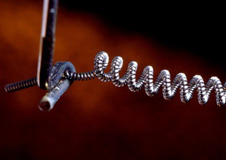

*Réponse publiée [sur Quora](https://fr.quora.com/Pourquoi-les-ampoules-%C3%A0-incandescence-ont-elles-g%C3%A9n%C3%A9ralement-une-dur%C3%A9e-de-vie-courte-par-rapport-aux-autres-types-d%C3%A9clairage/answer/Dr-Goulu)*

parce que pour produire un max de lumière visible leur filament doit être le plus chaud possible, donc tout près de leur température de fusion, et que là, il se sublime assez vite.

Dès que le filament devient très légèrement plus fin à un endroit, sa résistance électrique augmente, il chauffe plus à cet endroit par effet joule, il se sublime plus, et cette contre-réaction positive va très vite provoquer la fusion et la rupture du filament.

Vous avez déjà regardé un filament de près ?

le fil fait 46 microns de diamètre, avec une tolérance de 0.5% …

[La véritable histoire de l'ampoule de Livermore - Pourquoi Comment Combien](/2011/10/16/la-veritable-histoire-de-lampoule-de-livermore/)
