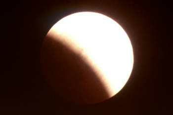

*Réponse publiée [sur Quora](https://fr.quora.com/Pourquoi-l-ombre-port%C3%A9e-de-la-terre-sur-la-lune-para%C3%AEt-concave-alors-qu-elle-devrait-%C3%AAtre-convexe/answer/Dr-Goulu)*

On peut avoir une photo de votre ombre concave ?

Voici l'ombre de la Terre sur la Lune pendant une éclipse de Lune :

ce brave Aristote considérait déjà que c'est une preuve de la rotondité de la Terre. Comme quoi même un philosophe peut dire quelque chose de sensé quand il s'appuie sur un fait expérimental.
