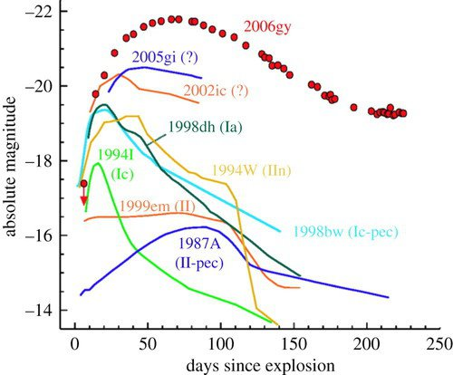

*Réponse publiée [sur Quora](https://fr.quora.com/Au-bout-de-combien-de-temps-la-luminosit%C3%A9-diminue-t-elle-quand-une-%C3%A9toile-n-existe-plus/answer/Dr-Goulu)*

Les étoiles existent "toujours". Les naines blanches mettent des milliards de milliards d'années à ne plus rayonner dans le visible. Les supernova éjectent de la matière qui reste chaude longtemps, et le trou noir ou étoile à neutrons qui reste peut avoir un disque d'accrétion lumineux.

Bref je chipote un peu mais la luminosité d'une étoile varie au long de sa très longué vie.

Lors des supernova, l'étoile devient extraordinairement lumineuse pendant quelques jours, puis sa luminosité décroît exponentiellement. Elle reste plus lumineuse que l'étoile initiale pendant plusieurs années. (la magnitude absolue de Bételgeuse est de-5.85)

Source [Astrophysical explosions: from solar flares to cosmic gamma-ray bursts](https://royalsocietypublishing.org/doi/10.1098/rsta.2011.0351)
