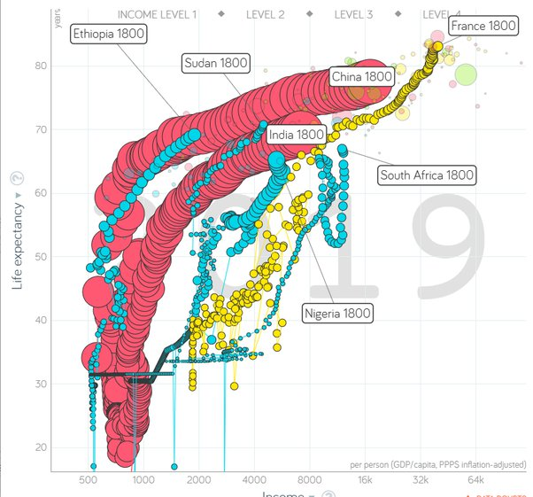

*Réponse publiée [sur Quora](https://fr.quora.com/Pourquoi-la-majorit%C3%A9-des-pays-noirs-sont-pauvres/answer/Dr-Goulu)*

Parce que des racistes blancs les ont exploités sans vergogne pendant des siècles, pillant leur richesses, créant des frontières pour diviser des peuples puissants et attiser des guerres entre eux pour les affaiblir, détruisant leur culture avec une morale et une religion qui les rabaisse et les asservit, enlevant les plus forts pour qu'ils travaillent comme des bêtes sur un autre continent après une traversée où la moitié mourraient enchaînés. Ce n'est pas très ancien, et même pas encore vraiment fini.

Mais si vous comparez leur progression sur le génial [graphique Gapminder](https://www.gapminder.org/tools/?from=world#$state$time$value=2019;&marker$select@$country=zaf&labelOffset@:0.277&:0.066;&trailStartTime=1800;&$country=nga&labelOffset@:0.165&:0.142;&trailStartTime=1800;&$country=eth&labelOffset@:0.07&:-0.543;&trailStartTime=1800;&$country=sdn&labelOffset@:-0.03&:-0.095;&trailStartTime=1800;&$country=fra&trailStartTime=1800;&$country=chn&trailStartTime=1800;&$country=ind&trailStartTime=1800;;;;&chart-type=bubbles) espérance de vie/revenu , vous voyez qu'ils suivent depuis leurs indépendances des trajectoires tout à fait comparables à celles des autres pays du monde. L'Ethiopie en est où était la Chine en 1993, et l'Afrique du Sud, après la dramatique chute due au SIDA en est où était la France en 1960.

Dans les pays ayant la plus forte [Croissance du PIB (% annuel)](https://donnees.banquemondiale.org/indicator/NY.GDP.MKTP.KD.ZG?most_recent_value_desc=true) en 2019 on trouve:

1. Tuvalu (pas en Afrique, mais pour utiliser la liste numérotée…)
2. Rwanda : 9.4%
3. Erythrée : 8.7%
4. Ethiopie : 8.3%

… (pays asiatiques dont le Bangladesh, le Vietnam, le Népal…)

12. Bénin : 6.9%

13. Côte d'Ivoire : 6.9%

14. Ouganda : 6.5%

15. Ghana : 6.5%

16. (Turkmenistan)

17. Chine : 6.2

…

(très loin) France : 1.5%

A ce rythme là, votre question va devenir obsolète très vite
