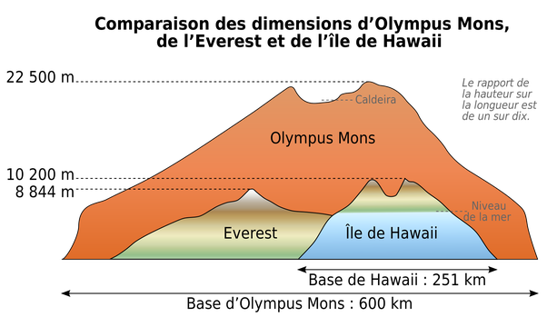

*Réponse publiée [sur Quora](https://fr.quora.com/Comment-les-humains-grimperaient-ils-le-mont-Olympus-sur-Mars/answer/Dr-Goulu)*

ils se poseraient dessus, plus simple …

Sinon, la pente moyenne de [Olympus Mons](w:)n'est que de 5°, pas trop dur à monter en véhicule à roues ou chenilles… sauf le début apparemment :

