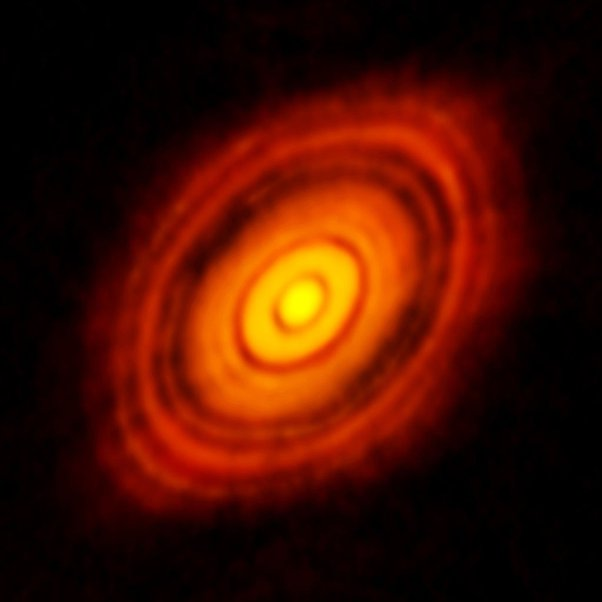

*Réponse publiée [sur Quora](https://fr.quora.com/Pourquoi-les-plan%C3%A8tes-des-%C3%A9toiles-tournent-elles-toutes-dans-le-m%C3%AAme-sens-et-dans-le-m%C3%AAme-plan-et-non-pas-dans-une-sph%C3%A8re-comme-les-%C3%A9lectrons-d-un-atome/answer/Dr-Goulu)*

1. les électrons d'un atome ne tournent pas dans une sphère mais se trouvent dans des [Orbitales atomiques](w:Orbitale_atomique)
2. la [Conservation du moment cinétique](w:)est universelle. Elle s'applique même à la [Formation et évolution du Système solaire](w:), et fait que tout tourne dans le même sens
3. les chocs et frottements entre les corps font qu'ils s'équilibrent dans le plan perpendiculaire au moment cinétique lors de la formation du [Disque protoplanétaire](w:).

Voyez cette magnifique image du système de [HL Tauri](w:)en train de se former :

