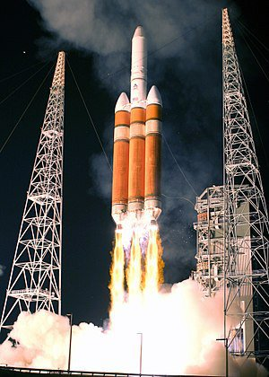
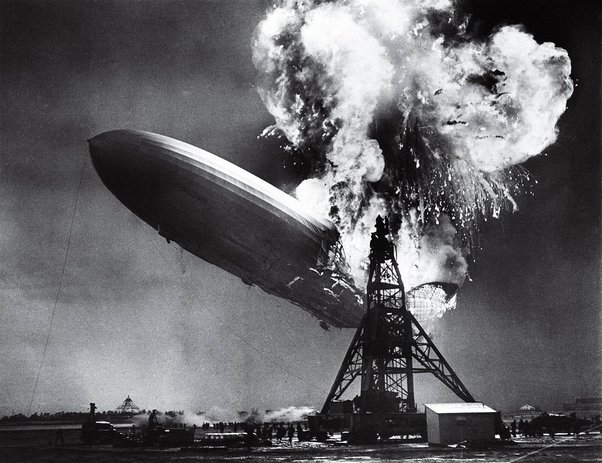

*Réponse publiée [sur Quora](https://fr.quora.com/Si-l-eau-n-est-faite-que-de-deux-atomes-d-hydrog%C3%A8ne-et-d-un-atome-d-oxyg%C3%A8ne-pourquoi-ne-peut-on-pas-en-produire/answer/Dr-Goulu)*

fusée en train de produire de l'eau

dirigeable en train de produire de l'eau.
