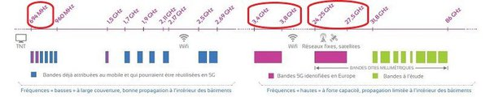
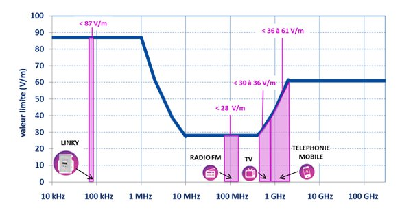

*Réponse publiée [sur Quora](https://fr.quora.com/Le-rayonnement-%C3%A9lectromagn%C3%A9tique-class%C3%A9-potentiellement-canc%C3%A9rig%C3%A8ne-par-l-OMS-est-il-plus-fort-avec-la-5G/answer/Dr-Goulu)*

pour rappel :

1. sur la [Liste des cancérogènes du groupe 2B du CIRC](w:)il y a aussi le café …
2. "potentiellement" signifie ici soit (définitions CIRC)
3. depuis 2011, les ondes EM sont toujours sur cette même liste donc toutes les études effectuées depuis n'ont pas permis d'éclaircir la situation

Donc [Pourquoi je n'ai toujours pas peur de mon téléphone mobile](/2011/06/03/pourquoi-je-nai-toujours-pas-peur/)est toujours valable :

> de nombreux tests sur les relations entre téléphones portables et cancer montre qu’une éventuelle relation est très faible, et ne peut honnêtement pas être statistiquement distinguée de pas de relation du tout. Bien sur, il n’est pas possible de l’exclure non plus, donc il y a le mot “potentiellement”.

Autrement dit, une fois que le café, pardon les ondes EM, sont sur cette liste, elles y restent.

Venons-en à la question avec cette petite illustration:

( source : [Tout savoir sur les fréquences de la 5G](https://blog.ariase.com/mobile/dossiers/5g-frequences) )

1. La 5G actuelle émet dans les mêmes bandes de fréquences que les 2+3+4G actuelles, et plutôt avec des puissances plus faibles parce qu'on met plus d'antennes plus rapprochées
2. dans les bâtiments elle utilise aussi les fréquences de 3.4 à 3.8GHz utilisées par les WiFi, donc bien connues, avec des puissances similaires
3. les fréquences plus élevées (26 Ghz) sont destinées à des communications futures à très haut débit, point à point, courte distance. Ce sont des fréquences similaires à celles des radars qui arrosent toute la population depuis des décennies à forte puissance sans effet notable.
4. il existe des normes d'exposition en fonction de la fréquence (courbe bleue ci-dessous) qui, comme toutes les normes sont des dizaines, voire des centaines de fois en dessous des valeurs dangereuses. Et les appareils mesurés (petites flèches) sont eux-mêmes encore largement en dessous de ces normes ( source : [Ondes électromagnétiques : comment réduire notre exposition ?](https://www.clubic.com/sante/article-886696-1-ondes-electromagnetiques-comment-reduire-exposition.html) )

Donc le rayonnement de la 5G ne sera pas plus néfaste que ceux des générations précédentes, qui ne l'est pas.
