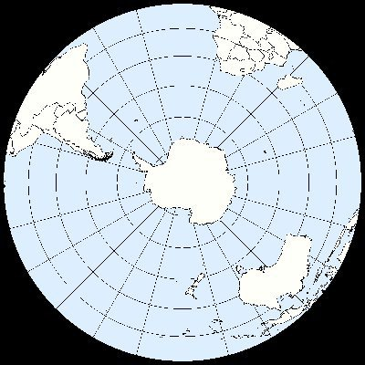

*Réponse publiée [sur Quora](https://fr.quora.com/Pourquoi-sur-le-site-zoom-earth-ou-d-autre-l-antarctique-est-ultra-immense/answer/Dr-Goulu)*

Il est immense, 2 fois la surface de l'Australie, 1.5 fois plus grand que l'Europe (jusqu'à l'Oural)

Peut-être que le système de projection utilisé par certaines sites exagère les surfaces polaires, mais en projection polaire on a ça :

