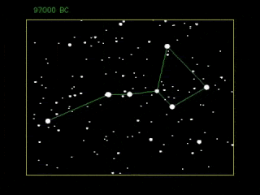

*Réponse publiée [sur Quora](https://fr.quora.com/Pourquoi-les-formes-des-constellations-ne-changent-elles-pas-Les-corps-c%C3%A9lestes-ne-sont-ils-pas-cens%C3%A9s-bouger/answer/Dr-Goulu)*

Ça bouge, mais pas vite.

Voilà comment la Grande Ourse a changé en 100'000 ans et va changer dans les prochains 100'000 ans (et les étoiles dans ce coin de ciel)

