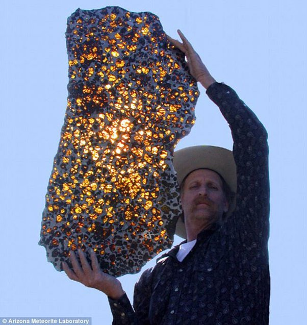

*Réponse publiée [sur Quora](https://fr.quora.com/Est-il-exact-que-certaines-m%C3%A9t%C3%A9orites-peuvent-atteindre-le-prix-d-un-million-de-dollars-am%C3%A9ricains/answer/Dr-Goulu)*

D'après [Top 10 des plus chères météorites jamais proposées à la vente - Catawiki](https://www.catawiki.eu/stories/4683-top-10-des-plus-cheres-meteorites-jamais-proposees-a-la-vente) il n'y a que la [Météorite de Fukang](w:)qui a atteint ce prix, et quand on la voit, on comprend :

[La belle et mystérieuse météorite de Fukang](https://guydoyen.fr/2012/07/29/la-belle-et-mysterieuse-meteorite-de-fukang/)
