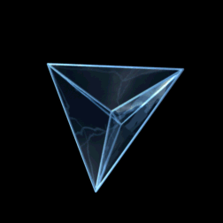

*Réponse publiée [sur Quora](https://fr.quora.com/Les-atomes-despace-ou-voxels-existent-ils/answer/Dr-Goulu)*

il est très possible, voire probable que l'espace-temps soit discret à l'[échelle de Planck](w:Longueur_de_Planck), en effet. C'est une des idées de base de la [Gravitation quantique à boucles](w:).

Le terme d'atome ou de voxel n'est pas bien choisi, on pourrait plutôt parler de "brique d'espace-temps", qui pourrait ressembler à ça :

Ce truc est un "4-[simplexe](http://www.wikipedia.org/search-redirect.php?language=fr&go=Go&search=simplexe)", appelé aussi "[pentachore](http://www.wikipedia.org/search-redirect.php?language=fr&go=Go&search=pentachore)" et c'est l'équivalent d'un tétraèdre en 4D (celui-ci euclidien, il faudrait représenter l[e temps comme dimension imaginaire](/2007/02/07/le-temps-une-4eme-dimension-imaginaire/#.X3X4bGiFqCo) pour faire plus vrai…)

C'est l'idée développée par Jarmo Mäkelä dans son essai “[Is Reality Digital or Analog?](http://fqxi.org/data/essay-contest-files/Mkel_FQxiessay.pdf)” qui a remporté le premier [prix du concours FQXi 2011](http://www.fqxi.org/community/essay/winners/2011.1)

et dont je cause ici : [Selon Newton, l'univers serait discret - Pourquoi Comment Combien](/2011/08/13/selon-newton-lunivers-serait-digital/)

D'autres comme Lee Smolin, [Timothy Budd](http://www.nbi.dk/~budd/) ou [Fotini Markopoulou](http://www.wikipedia.org/search-redirect.php?language=en&go=Go&search=Fotini+Markopoulou) proposent plutôt que l’espace émerge d’une structure de graphe. Ca s'appelle “[triangulation dynamique causale](http://www.wikipedia.org/search-redirect.php?language=en&go=Go&search=causal+dynamical+triangulation)” ou “[graphité quantique](http://www.wikipedia.org/search-redirect.php?language=en&go=Go&search=quantum+graphity)” (sic) et c'est incompréhensible mais fait des vidéos très jolies :

[https://youtu.be/lzJpC78zduo](https://youtu.be/lzJpC78zduo)

voir [La Renaissance du temps 2/2 - Pourquoi Comment Combien](/2015/12/31/la-renaissance-du-temps-22/)
