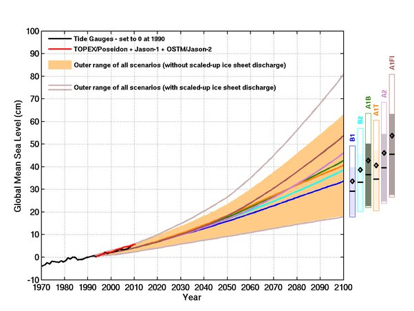

*Réponse publiée [sur Quora](https://fr.quora.com/Comment-s-y-retrouv%C3%A9-avec-la-mont%C3%A9e-des-eaux-Certaines-parlent-de-60cm-d-ici-2100-et-d-autres-de-25m-d-ici-2030-Comment-ses-valeurs-peuvent-elles-%C3%AAtre-aussi-diff%C3%A9rentes/answer/Dr-Goulu)*

personne de sérieux ne parle de 25 m en 10 ans. C'est probablement une erreur de journaliste qui a confondu les mm et les m …

Les prévisions de l'[Élévation du niveau de la mer](w:) se sont beaucoup affinées ces dernières années suite à de très nombreuses études scientifiques, mais il reste une marge d'erreur importante, du simple au triple jusqu'en 2100

( source : [CSIRO & ACECRC ::](https://www.cmar.csiro.au/sealevel/sl_proj_21st.html) )

donc voilà, ce sera 40cm +/- 20 cm d'ici 2100, et plutôt 25 mm d'ici 2030.
