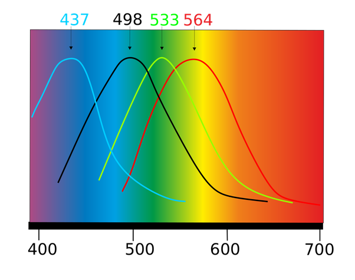

*Réponse publiée [sur Quora](https://fr.quora.com/Pourquoi-est-ce-que-je-vois-RVB-quand-je-regarde-loin-d-une-lumi%C3%A8re-blanche/answer/Dr-Goulu)*

parce que les [Cônes photorécepteurs](w:Cône_(photorécepteur)) de votre rétine sont de trois types, chacun étant sensible grosso-modo au rouge, vert et bleu. Plus précisément selon ces courbes (la noire est la courbe des bâtonnets qui donnent la vision "de nuit")

Donc on voit bien le blanc en RVB :-)
