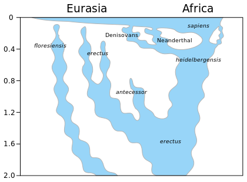

*Réponse publiée [sur Quora](https://fr.quora.com/Quand-est-ce-que-les-sentinelles-seront-tellement-%C3%A9loign%C3%A9es-g%C3%A9n%C3%A9tiquement-de-nous-quils-formeront-une-autre-esp%C3%A8ce-la-reproduction-viable-ne-sera-plus-possible/answer/Dr-Goulu)*

Si vous regardez ce graphique retraçant le passé des espèces humaines, vous voyez que des [Hybridations entre Sapiens et Neanderthal et Denisova](w:Hybridation_entre_les_humains_archaïques_et_modernes) ont eu lieu après 300'000 ans de séparation

Difficile de dire si une hybridation Erectus/Sapiens aurait pu être possible après 1 million d'années (quorans généticiens ?)

Je parie plus sur la disparition très prochaine des [Sentinelles](w:Sentinelles_(peuple))que sur l'apparition de nouvelles espèces d'Homo.
