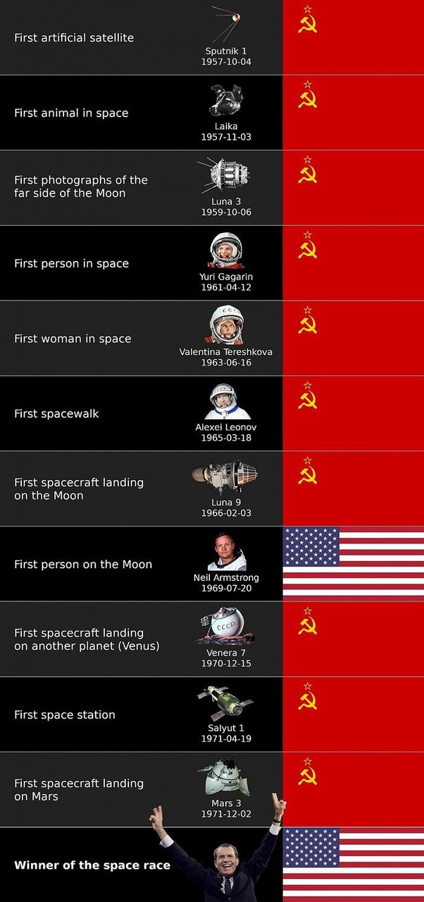

*Réponse publiée [sur Quora](https://fr.quora.com/%C3%80-quel-point-les-Sovi%C3%A9tiques-%C3%A9taient-ils-pr%C3%A8s-de-remporter-la-course-%C3%A0-l-espace/answer/Dr-Goulu)*

Je ne vais pas traduire toute la réponse de [Mikhail Buleev's à How close were the Soviets to actually winning the space race?](https://www.quora.com/How-close-were-the-Soviets-to-actually-winning-the-space-race/answer/Mikhail-Buleev?ch=10&share=fd60c804&srid=pzDv), juste copier l'infographie qui l'illustre :

Les américains n'ont réussi que les premières missions habitées sur la Lune. Les soviétiques ont remporté la course à l'espace. Encore plus clairement depuis l'arrêt des navettes spatiales. Ce sont les russes qui maintiennent l'ISS en fonction.
