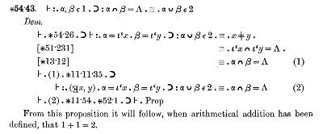

*Réponse publiée [sur Quora](https://fr.quora.com/Pouvez-vous-citer-un-livre-qui-contient-une-v%C3%A9rit%C3%A9-absolue-prouv%C3%A9e-et-indiscutable-s-il-vous-pla%C3%AEt-vous-abstenir-citer-la-Bible-ou-autre-livret-de-sorte/answer/Dr-Goulu)*

[Principia Mathematica](w:)d'[Alfred North Whitehead](w:) et [Bertrand Russell](w:) contient entre autres la preuve formelle, absolue et indiscutable que 1+1=2

