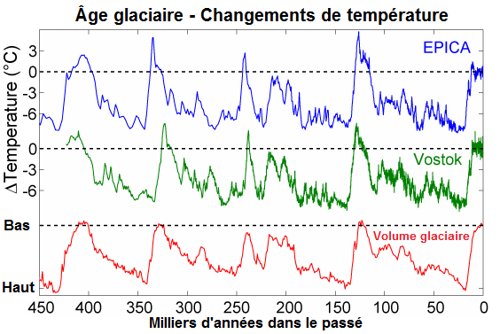
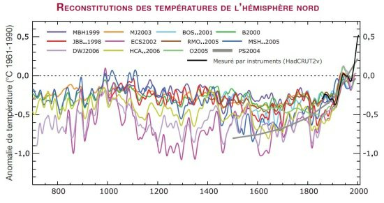

*Réponse publiée [sur Quora](https://fr.quora.com/Le-r%C3%A9chauffement-climatique-est-ind%C3%A9niablement-entrain-de-gagner-du-terrain-mais-n-est-ce-pas-juste-la-plan%C3%A8te-qui-suit-son-cycle-normal-en-sortant-de-l-%C3%A8re-glaciaire-Comme-ce-fut-le-cas/answer/Dr-Goulu)*

Si vous regardez l'évolution des températures pendant les derniers 450'000 ans, vous voyez que la température après une Glaciation remonte de 6 à 10 degrés en plusieurs milliers d'années

Les variations enregistrées pendant le palier qui dure depuis 5000 ans sont minimes, 1 degré environ. Zoom sur les 1500 dernières années :

(source [Réchauffement climatique : évolution du climat mondial et en France](http://www.meteofrance.fr/climat-passe-et-futur/le-rechauffement-observe-a-l-echelle-du-globe-et-en-france))

Et ça c'est jusqu'à 2000, la tendance se poursuit, nous aurons sans aucun doute un réchauffement de plus de deux degrés ce siècle. 2 degrés par siècle, c'est :

- 10 fois plus rapide qu'un réchauffement de 6 degrés en 3000 ans qu'on peut imaginer après une Glaciation.
- Du jamais vu dans l'histoire, la préhistoire et avant
- Pas normal du tout pendant une période interglaciaire
- Ne correspond à aucun phénomène naturel connu
- Correspond parfaitement aux émissions humaines.
