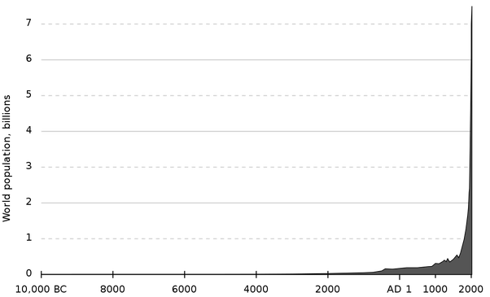

*Réponse publiée [sur Quora](https://fr.quora.com/Pouvons-nous-estimer-la-population-mondiale-morte-plus-vivante-de-la-cr%C3%A9ation-%C3%A0-ce-jour/answer/Dr-Goulu)*

106.456.367.669 selon [Quel est le nombre de personnes qui ont vraiment vécu sur la Terre ?](https://www.prb.org/quelestlenombredepersonnesquiontvraimentvecusurlaterre/)

On a évidemment de mauvaises estimations du nombre d'humains qui vivaient il y a 100'000 ans ou plus, mais on sait qu'il était très petit

Et quand on voit ce graphique:

(Source : [Population mondiale — Wikipédia](w:Population_mondiale))

On comprend que l'incertitude sur le passé n'a que peu d'influence sur le résultat final.
