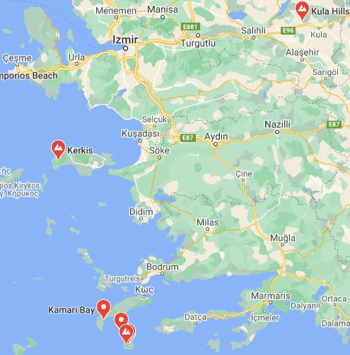

*Réponse publiée [sur Quora](https://fr.quora.com/Comment-r%C3%A9agir-lorsque-certains-pr%C3%A9tendent-que-le-r%C3%A9cent-s%C3%A9isme-dIzmir-a-%C3%A9t%C3%A9-provoqu%C3%A9-par-le-projet-HAARP/answer/Dr-Goulu)*

Donc nous avons [un tremblement de terre](https://earthquake.usgs.gov/earthquakes/eventpage/us7000c7y0/executive) de magnitude 7.0 dont l'épicentre est situé plus près de l'île grecque de Samos que de la côte turque, dans une région qui est souvent secouée (6.7 sur l'île de Kos en 2017) parce qu'il y a plein de failles géologiques dans le coin.

Il y a aussi des volcans : 4 actifs en Grèce, et une centaine(!) d'éteints[[1]](#lcQhX), et plusieurs en Turquie aussi , dont le [Kula](w:en:Kula_(volcano)), pas loin d'Izmir et qui était actif dans les années 1970, voilà la carte :

Donc ya même pas besoin de savoir ce que fait [HAARP](w:High_frequency_active_auroral_research_program) en Alaska pour réagir comme ça :

[https://www.youtube.com/watch?v=...](https://www.youtube.com/watch?v=sYU_eDMr4xE)

Notes de bas de page

[[1]](#cite-lcQhX)[Global Volcanism Program | Database Search](https://volcano.si.edu/search_volcano.cfm)
