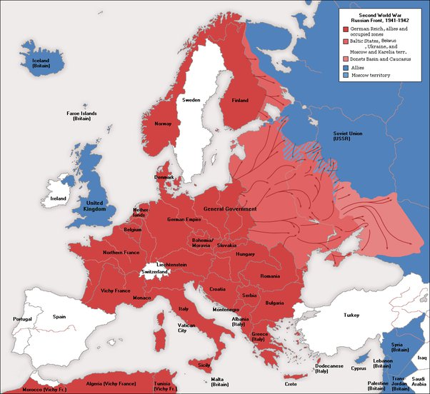

*Réponse publiée [sur Quora](https://fr.quora.com/La-Suisse-%C3%A9tait-elle-vraiment-neutre-partout-dans-les-deux-guerres-mondiales/answer/Dr-Goulu)*

Militairement oui, ou presque

Elle n'avait pas d' alliance avec un belligérant et ses troupes sont restées systématiquement en défense sur le territoire.

L'aviation et la DCA ont notamment abattu 11 avions allemands qui tentaient de survoler la Suisse pour contourner les défenses françaises (voir [Incidents aériens en Suisse de 1940 — Wikipédia](w:Incidents_aériens_en_Suisse_de_1940))

Il y a aussi eu des accrochages avec l'aviation alliée qui s'est parfois trompée de cible (voir [Bombardement de la Suisse pendant la Seconde Guerre mondiale](w:))

17 militaires suisses ont été exécutés pour haute trahison, tous (?) au profit de l'Allemagne.

Il y avait aussi un accord secret entre la Suisse et la France que les allemands ont découvert ([Affaire de La Charité-sur-Loire — Wikipédia](w:Affaire_de_La_Charité-sur-Loire)) ce qui fait que la Suisse était "presque" neutre, mais pas tout à fait.

Économiquement, il est difficile d'être neutre dans cette situation :

