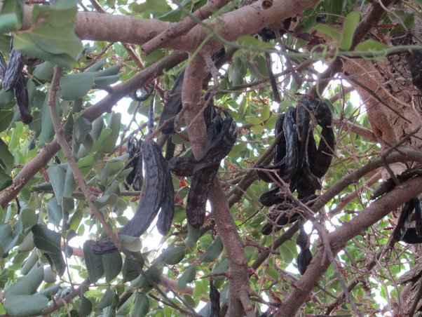

*Réponse publiée [sur Quora](https://fr.quora.com/Pourriez-vous-me-dire-ce-que-c-est-photo-en-commentaire-Il-y-en-a-plein-au-pied-d-un-arbre-pr%C3%A8s-de-chez-moi-et-je-n-ai-jamais-su-ce-que-c-%C3%A9tait/answer/Dr-Goulu)*

Probablement des graines de [Caroubier](w:)

