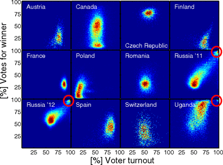

*Réponse publiée [sur Quora](https://fr.quora.com/Comment-prouver-que-l%C3%A9lection-de-Joe-Biden-nest-pas-frauduleuse/answer/Dr-Goulu)*

Il existe des méthodes statistiques de détection de fraude électorale. A Genève nous en utilisions deux:

1. une méthode basée sur la loi de Benford, mais elle ne permet de détecter que le remplissage de résultats au hasard ou avec un fonction "random" de génération de nombres équiprobables[[1]](#mOAuU) . J'avais recommandé de la laisser tomber.
2. le "Test du modèle binomial robuste sur-dispersé" qui est beaucoup plus efficace et solide mathématiquement . En gros il détecte les changements de résultats d'un bureau de vote par rapport aux votes précédents [[2]](#loEtP) (cool j'ai retrouvé ma présentation !) donc il n'est applicable que dans un pays qui vote (très) souvent comme la Suisse

Il existe une méthode toute simple qui permet de détecter le bourrage d'urnes courant dans certains pays : faire un nuage de points résultat/taux de participation avec tous les bureaux de vote:

Si on trouve autre chose qu'un nuage, notamment un second groupe de points près de 100% de participation à 100% de votes en faveur d'un candidat, ça pue.

Je ne sais pas si les commissions électorales US utilisent ce genre de choses. On dirait que non. Après une petite recherche , j'ai trouvé les données du MIT [County Presidential Election Returns 2000-2016](https://dataverse.harvard.edu/dataset.xhtml?persistentId=doi:10.7910/DVN/VOQCHQ) qui donne les résultats des présidentielles de 2000 à 2016 comté par comté, mais hélas ils ne fournissent pas le nombre d'inscrits, donc on ne peut pas calculer la participation… Je viens de la leur demander pour 2020, je vous tiens au courant …

Référence : Peter Klimek, Yuri Yegorov, Rudolf Hanel, & Stefan Thurner (2012). It’s not the voting that’s democracy, it’s the counting: Statistical detection of systematic election irregularities PNAS DOI: [10.1073/pnas.1210722109](http://dx.doi.org/10.1073/pnas.1210722109) [(pdf)](http://arxiv.org/pdf/1201.3087.pdf)

Notes de bas de page

[[1]](#cite-mOAuU)[Fraudez fort, fraudez Benford - Pourquoi Comment Combien](/2012/12/07/fraudez-benford/#.X6lhrGgVOCo)

[[2]](#cite-loEtP)[Indicateurs statistiques de fraude électorale](https://fr.slideshare.net/Goulu/indicateurs-statistiques-de-fraude-lectorale)
